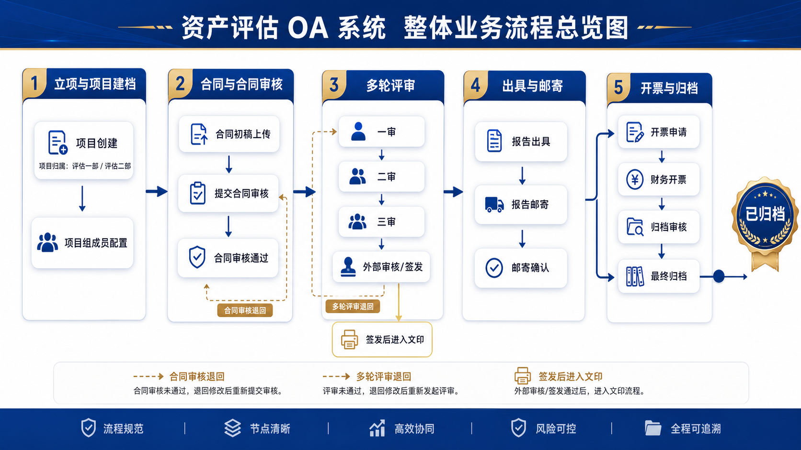
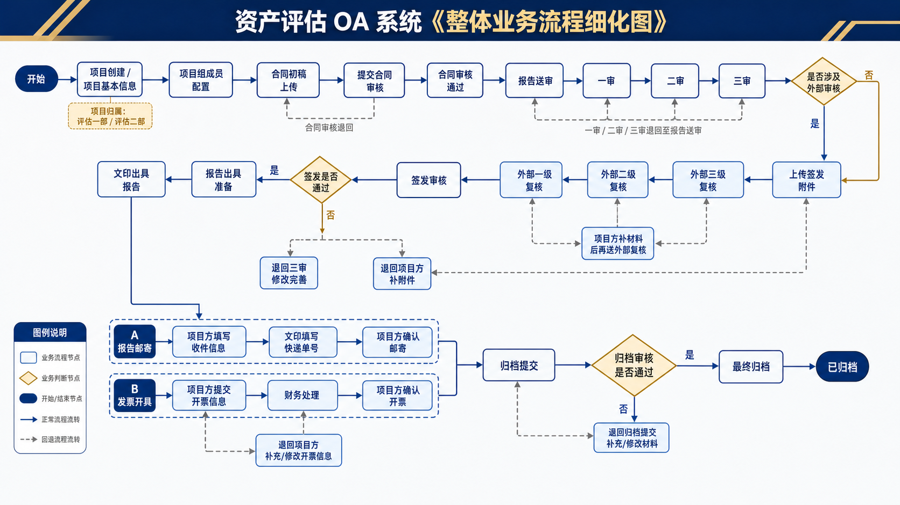
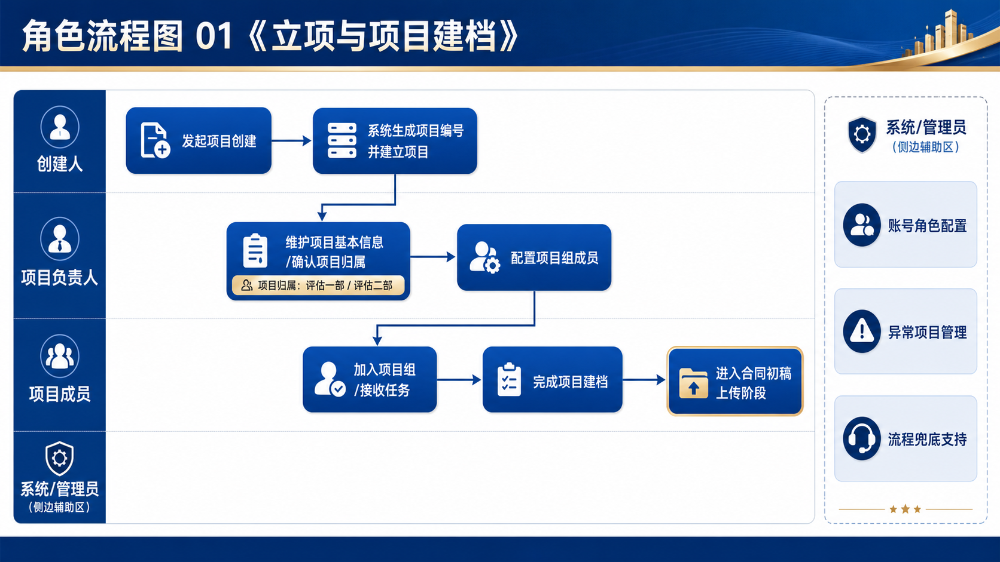
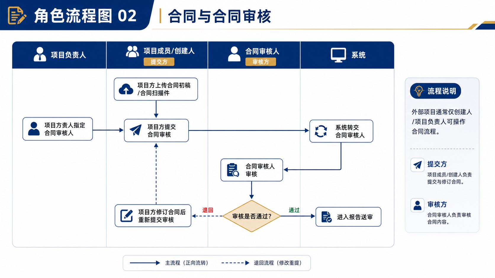
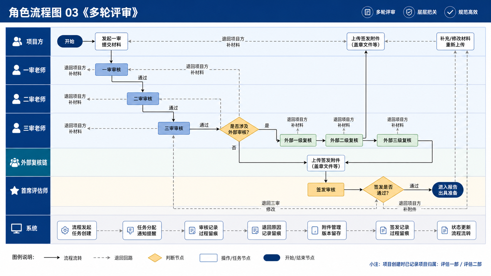
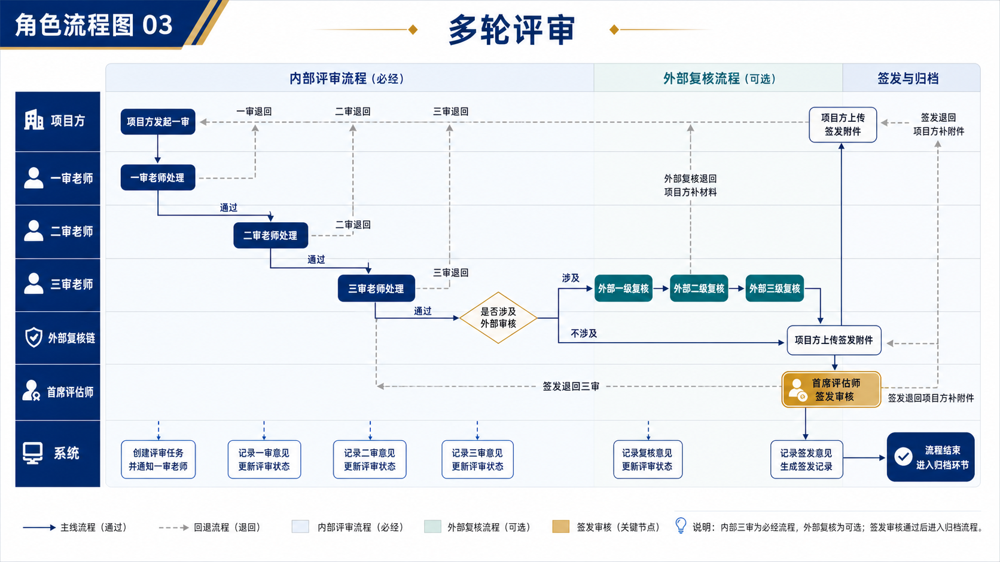
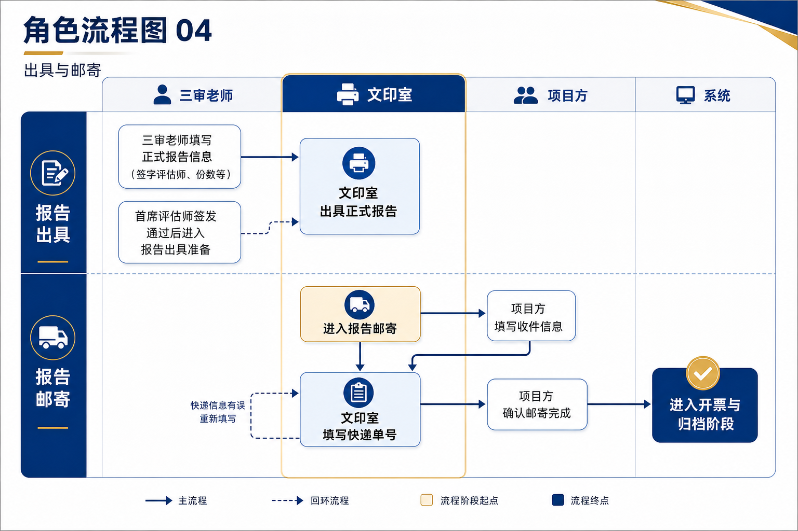

# OA系统内部培训说明书

版本口径：当前仓库版本  
适用对象：项目负责人、项目成员、审核老师、首席评估师、文印、财务、档案、管理员  
使用目标：帮助内部人员快速理解系统流程、角色分工和常用操作

---

## 1. 系统定位

本系统不是通用审批 OA，而是面向**资产评估项目全流程管理**的业务系统。  
系统覆盖的核心环节包括：

- 项目创建与项目组配置
- 合同上传与合同审核
- 一审、二审、三审
- 签发审核
- 报告出具与邮寄
- 发票开具
- 报告归档

系统目标是让项目从立项到归档形成完整闭环，减少线下沟通和资料遗漏。

---

## 2. 登录与工作区

### 2.1 登录方式

用户输入账号和密码后登录系统。  
如果账号同时具备**管理员角色**和**业务角色**，系统会弹出工作区选择框：

- 进入管理员工作区
- 进入业务工作区

### 2.2 工作区说明

- 管理员工作区：用于账号管理、终止/废止审核、项目删除审核、项目冲突提醒、帮助中心维护等管理动作
- 业务工作区：用于项目日常办理、审核、签发、文印、财务、归档等业务动作

### 2.3 切换工作区

登录后，右上角账号下拉菜单中提供**切换工作区**入口。  
适用于同一账号同时承担管理员和业务职责的情况。

---

## 3. 整体流程总览

### 3.1 主流程

一个标准项目通常按以下顺序推进：

1. 创建项目
2. 配置项目组成员
3. 上传合同初稿并提交合同审核
4. 发起一审、二审、三审
5. 上传签发附件并完成签发
6. 文印出具正式报告
7. 发起报告邮寄
8. 提交开票信息
9. 提交归档并完成归档

### 3.2 特别说明

- 邮寄和开票在后段是并行办理关系
- 归档是项目结束前的最后环节
- 如果流程中出现退回，需要由项目方补充资料后重新提交

---

## 4. 整体流程细化

### 4.1 关键判断点

需要重点关注以下几个判断节点：

- 合同审核是否通过
- 一审、二审、三审是否通过
- 签发是否通过
- 归档审核是否通过

### 4.2 常见回退场景

- 合同审核退回：项目方修改合同后重新提交
- 评审退回：项目方根据意见补充或修改后再次送审
- 签发退回：可能退回三审，也可能退回项目方补附件
- 归档退回：项目方补充底稿或资料后再次送审

---

## 5. 按阶段培训说明

### 5.1 阶段一：立项与项目建档

**谁来做**

- 创建人
- 项目负责人

**主要动作**

- 创建项目
- 录入基础信息
- 配置项目负责人
- 配置项目组成员

**培训重点**

- 项目名称、客户名称、业务性质要填写准确
- 项目来源按当前口径选择：评估一部 / 评估二部
- 项目组成员配置完成后，项目才会进入后续业务办理

**注意**

- 项目负责人、项目成员属于“项目方”
- 项目方不能再兼任合同审核、一二三审、文印、财务、档案角色

---

### 5.2 阶段二：合同上传与合同审核

**谁来做**

- 项目负责人 / 项目成员
- 合同审核人

**主要动作**

- 上传合同初稿
- 指定合同审核人
- 提交合同审核
- 合同审核人通过或退回

**培训重点**

- 上传前确认合同版本正确
- 提交审核后，项目方不能再直接跳过合同审核进入后续评审
- 合同被退回后，要重新修改并再次提交

---

### 5.3 阶段三：评审与签发

**谁来做**

- 项目方
- 一审老师
- 二审老师
- 三审老师
- 首席评估师

**主要动作**

- 发起一审
- 一审通过后发起二审
- 二审通过后发起三审
- 上传签发附件
- 首席评估师签发审核

**培训重点**

- 一审、二审、三审必须由不同账号担任
- 一/二/三审老师不能担任本项目签字评估师
- 项目方不能兼任审核老师
- 签发前需确认报告附件、合同扫描件等资料齐全

**当前版本重要规则**

- 一审、二审、三审彼此互斥
- 审核老师与签字评估师互斥
- 系统已做后端强校验，违规分配会被拦截

---

### 5.4 阶段四：报告出具与邮寄

**谁来做**

- 三审老师
- 文印室
- 项目方

**主要动作**

- 填写正式报告信息
- 文印出具报告
- 项目方填写邮寄信息
- 文印填写快递单号
- 项目方确认邮寄结果

**培训重点**

- 文印负责正式出具和快递单号填写
- 项目方负责确认收件信息是否正确
- 邮寄信息如需修改，要重新核对后再提交

---

### 5.5 阶段五：开票与归档

**谁来做**

- 项目方
- 财务
- 档案管理员

**主要动作**

- 项目方提交开票信息
- 财务处理开票
- 项目方提交归档
- 档案管理员审核归档
- 项目方最终归档

**培训重点**

- 签发通过后的三个文件会自动同步到归档资料区：
  - 报告资料包
  - 报告附件
  - 合同扫描件
- 这三类同步文件在归档环节只可下载，不可删除、不可重新上传
- 当前版本允许“提交电子底稿”时不先上传文件，直接送审

---

## 6. 角色分工速查

### 6.1 项目方

包括：

- 创建人（当其同时是项目负责人/项目成员时按项目方处理）
- 项目负责人
- 项目成员

主要职责：

- 创建项目
- 上传合同和业务资料
- 发起评审
- 补充退回资料
- 发起邮寄、开票、归档

### 6.2 审核角色

包括：

- 合同审核人
- 一审老师
- 二审老师
- 三审老师
- 首席评估师

主要职责：

- 对项目资料进行审核
- 提出退回意见
- 通过后推动项目进入下一环节

### 6.3 支撑角色

包括：

- 文印室
- 财务
- 档案管理员

主要职责：

- 文印：出具报告、填写快递信息
- 财务：办理开票
- 档案：审核归档资料

---

## 7. 当前版本角色规则

### 7.1 项目方互斥规则

同一项目中，项目方不能兼任：

- 合同审核人
- 一审老师
- 二审老师
- 三审老师
- 文印室处理人
- 财务处理人
- 档案管理员

### 7.2 评审互斥规则

同一项目中：

- 一审、二审、三审不能由同一账号兼任

### 7.3 审核与签字互斥规则

同一项目中：

- 一审老师
- 二审老师
- 三审老师

不能担任本项目签字评估师。

---

## 8. 帮助中心怎么用

系统左侧菜单中已提供**帮助中心**，下设：

- 流程图总览
- 整体业务流程
- 角色流程图
- 使用说明

建议培训时这样使用：

1. 先看“流程图总览”，理解整体结构
2. 再看“整体业务流程”，理解主线顺序
3. 最后按角色进入“角色流程图”和“使用说明”

这样更容易让新同事建立整体认知。

---

## 9. 常见问题

### 9.1 为什么我登录后会先让我选择工作区？

因为当前账号同时具备管理员角色和业务角色。  
系统会要求你选择本次进入管理员工作区还是业务工作区。

### 9.2 为什么我不能把某个成员选成审核老师或财务？

因为该成员已经是本项目的项目方成员。  
根据当前版本规则，项目方不能兼任审核或支撑处理角色。

### 9.3 为什么签字评估师选不进去？

可能原因：

- 该人员已经担任一审、二审或三审老师
- 当前版本禁止审核老师兼任签字评估师

### 9.4 归档时为什么已经自动有文件了？

因为签发通过后，系统会自动同步以下文件到归档资料区：

- 报告资料包
- 报告附件
- 合同扫描件

这是当前版本的自动归档支持能力。

---

## 10. 培训建议

为了让内部培训效果更好，建议按下面顺序讲解：

1. 先讲系统定位和整体流程
2. 再讲项目方如何发起与推进
3. 再讲审核老师、一审二审三审的衔接
4. 再讲文印、财务、档案如何接手
5. 最后讲角色互斥规则和常见报错原因

如果是新员工培训，建议配合以下材料一起使用：

- 本说明书
- 帮助中心流程图
- 一次真实项目演示

---

## 11. 说明书使用方式

这份说明书适合：

- 新员工入职培训
- 项目流程交接
- 管理员内部宣贯
- 系统升级后的再培训

建议每次系统流程规则有调整时，同步更新以下内容：

- 角色互斥规则
- 流程图
- 常见问题
- 帮助中心说明文案

---

## 12. 附：培训检查清单

培训结束后，建议确认学员已经掌握以下内容：

- 知道从哪里进入帮助中心
- 知道完整项目流程分几阶段
- 知道自己角色能做什么、不能做什么
- 知道退回后如何重新提交
- 知道签发、邮寄、开票、归档之间的关系
- 知道当前版本的角色互斥规则

如果以上内容都能回答清楚，说明培训基本达标。
